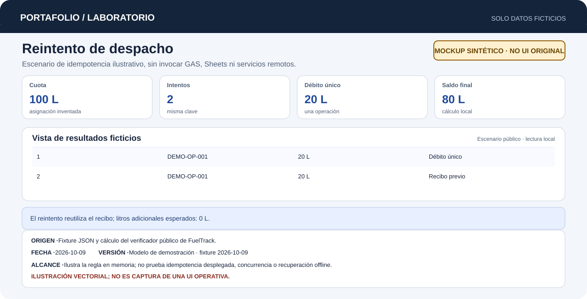

# FuelTrack

Control de solicitudes, aprobación y despacho de combustible en campo.

> [!NOTE]
> **Repositorio documental.** El código operativo y sus datos son privados. Aquí se publican documentación técnica, datos ficticios y un recorrido ilustrativo con verificación reproducible.

[Probar el ejemplo](#probar-el-ejemplo) · [Caso de estudio](docs/case-study.md) · [Arquitectura](docs/architecture.md) · [Verificación y límites](docs/verification.md)

[Abrir demo interactiva](demo/index.html) · [Ampliar mockup sintético](docs/images/mockup-synthetic.svg)

## Problema

La distribución de combustible en campo requiere coordinar la solicitud inicial, la autorización administrativa de cuotas y el despacho físico en estaciones o puntos remotos. Sin mecanismos de control, surgen discrepancias de saldo, demoras en autorización y riesgo de descontar dos veces una misma carga si la conexión se interrumpe y se reintenta el registro.

## Solución

Un sistema que organiza el flujo operativo en tres fases sincronizadas:
1. **Solicitud:** registro de requerimiento con unidad receptora, volumen requerido y justificación operativa.
2. **Aprobación:** validación administrativa en Google Apps Script / Google Sheets que bloquea temporalmente el registro con control de concurrencia y autoriza la cuota asignada.
3. **Despacho:** captura en punto de carga mediante PWA móvil, guardando comprobantes y firmas, con verificación de idempotencia por clave de operación para evitar duplicaciones.



El SVG se genera desde el escenario ficticio; muestra un débito único y saldo esperado de 80 L. No se conectó a GAS, Sheets ni a servicios remotos.

*Recorrido explicativo con datos sintéticos. Ilustración independiente; no ejecuta la aplicación operativa.*

## Aportación personal

Diseñé e implementé la solución a partir del relevamiento directo de las condiciones y necesidades diarias del suministro en campo: definí las reglas de validación de cuotas, el mecanismo de bloqueo concurrente (`LockService`) para evitar colisiones en saldos, la lógica de idempotencia por clave para impedir dobles despachos y la persistencia offline en IndexedDB para asegurar la continuidad operativa ante fallas de conectividad.

## Aportación de la automatización

| Etapa | Proceso manual previo | Aportación de la automatización |
|---|---|---|
| **1. Solicitud** | Vales en papel o mensajes sin folio único. | Registro estructurado con identificador único por unidad y conductor. |
| **2. Aprobación** | Autorizaciones verbales sin control de saldo disponible. | Resolución de alcance por rol, validación de cuota y bloqueo concurrente en servidor. |
| **3. Despacho** | Anotaciones sujetas a extravío o duplicación en campo. | Captura móvil con evidencias y clave de idempotencia diseñada para registrar 0 L adicionales en reintentos exactos. |
| **4. Contingencia** | Pérdida de información sin señal celular. | Cola local en IndexedDB que preserva borradores y pendientes hasta confirmar recepción. |

## Probar el ejemplo

Requiere Python 3 y biblioteca estándar. Desde la raíz del repositorio:

```text
python examples/verify.py
```

Ejecuta en memoria dos intentos con la misma clave y el mismo contenido. El primero descuenta 20 L; el reintento devuelve el mismo recibo y descuenta 0 L adicionales. La salida deja una operación única y saldo de 80 L.

Este modelo usa datos ficticios. No llama a Apps Script ni a Sheets y no valida la idempotencia operativa en red.

Para explorar el flujo paso a paso en el navegador, abra [demo/index.html](demo/index.html) de forma local (sin servidor ni credenciales).

## Resultados comprobados

- **Control de solicitudes y cuotas (evidencia histórica fechada):** 65 pruebas locales simuladas correctas (5 de octubre de 2026), cubriendo autorización, verificación de saldos, reintentos y consultas en entorno simulado. Esta evidencia histórica se distingue del ejemplo público reproducible.
- **Reintento reproducible:** el ejemplo público procesa dos intentos exactos y demuestra un solo descuento de 20 L en su modelo en memoria. La implementación de producción no se ejecuta aquí.
- **Conservación de pendientes en campo:** diseño de almacenamiento local en IndexedDB para resguardar firmas y datos ante desconexión temporal.

No se publican métricas de ahorro de combustible ni tiempos de respuesta operativos sin medición formal.

## Tecnologías

| Alcance | Tecnologías |
|---|---|
| Observadas en la fuente | Google Apps Script, Google Sheets, Google Drive, JavaScript, IndexedDB, PWA |
| Ejemplo público | Python 3 (biblioteca estándar), HTML/CSS estático autónomo |

## Límites

- Las 65 pruebas se ejecutaron en entorno simulado local fechado (5 de octubre de 2026), sin interactuar con los servicios reales de Google ni medir su latencia.
- El ejemplo público en Python sí simula dos solicitudes con la misma clave dentro de un proceso local; no llama a GAS/Sheets ni valida persistencia, concurrencia o idempotencia en red.
- La integración en un entorno activo de Google Sheets / Drive y las pruebas en dispositivos físicos en campo permanecen como validación operativa pendiente.
- El código fuente operativo es propiedad privada y no se distribuye en este repositorio.

Detalle técnico y condiciones pendientes: [verificación y límites](docs/verification.md).

## Licencia

Pendiente de decisión expresa. No se asigna licencia de software ni se transfieren derechos sobre el código privado.
