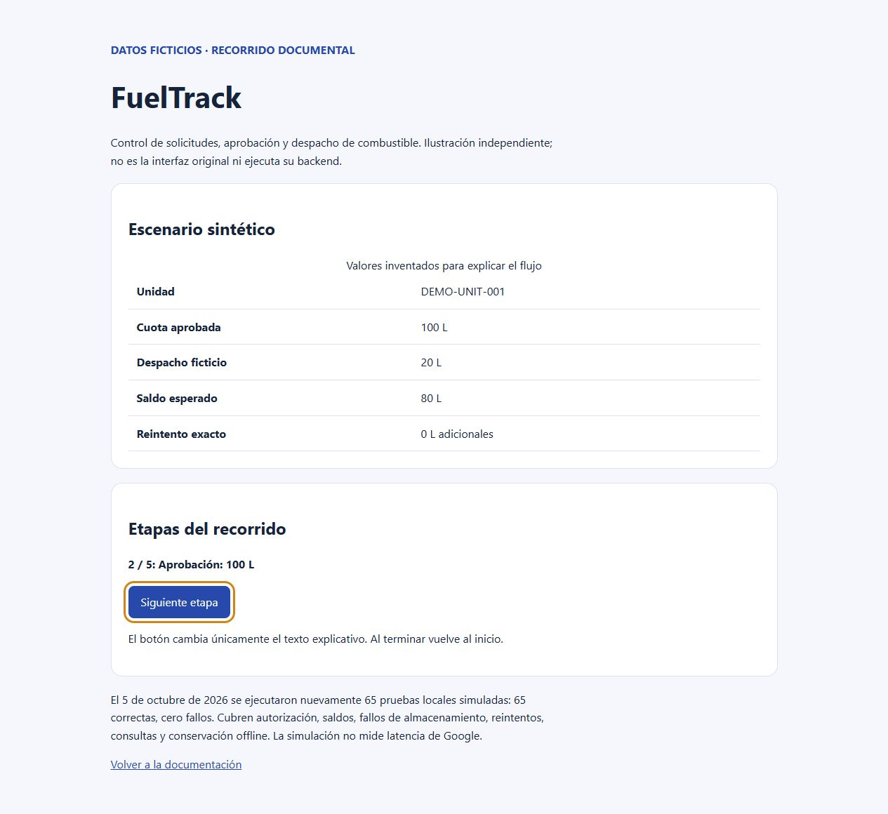

# FuelTrack

Control de solicitudes, aprobación y despacho de combustible.

**Estado:** caso de estudio documental de una implementación local revisada. El código operativo y sus datos no se distribuyen en este repositorio. Se publican documentación nueva y un recorrido ilustrativo con datos ficticios.

## Problema y solución

Coordinar solicitudes, autorización de cuotas y captura en campo, conservando evidencia y evitando descontar dos veces una operación reintentada.

La implementación local organiza solicitudes y aprobación, despacho con evidencia, saldos y consulta. El cliente de campo conserva borradores y pendientes en IndexedDB.

## Funciones observadas en la fuente

- Sesiones y alcance por rol y almacén resueltos por el servidor.
- Solicitud, aprobación y despacho con bloqueo compartido y escrituras por lote.
- Idempotencia por clave y contenido; reintentos exactos recuperan el resultado.
- Cola local, borradores, evidencia y recuperación conservando pendientes.
- Consultas paginadas y resúmenes reconstruibles sin sustituir el historial.

## Tecnologías verificadas

Google Apps Script, Google Sheets, Google Drive, JavaScript, IndexedDB, PWA. Consulte la [arquitectura](docs/architecture.md) para su función.

## Evidencia y resultados

El 5 de octubre de 2026 se ejecutaron nuevamente 65 pruebas locales simuladas: 65 correctas, cero fallos. Cubren autorización, saldos, fallos de almacenamiento, reintentos, consultas y conservación offline. La simulación no mide latencia de Google.

No se publican métricas de ahorro, adopción o productividad. La [verificación](docs/verification.md) explica su alcance. La aportación personal detallada y la autoría integral del código operativo no están acreditadas públicamente; este caso presenta la revisión técnica y la documentación del proyecto asociado al portafolio.

## Demostración y capturas

Abra [demo/index.html](demo/index.html) localmente. El recorrido funciona sin servidor, instalación ni conexión a servicios. Su tabla representa [datos sintéticos](examples/scenario.json), no una captura de la aplicación original. El botón recorre textos ilustrativos; no ejecuta operaciones de negocio.

Puede verificar los datos usando Python 3: `python examples/verify.py`.

## Caso de estudio

Consulte [problema, decisiones y aprendizajes](docs/case-study.md).

## Seguridad y limitaciones

Publicación independiente sin historial operativo. No incluye credenciales, identificadores de servicios, catálogos empresariales, datos personales, archivos de respaldo ni configuración productiva. Las pruebas de la fuente se ejecutaron con simulación o temporales aislados; el recorrido público es una explicación independiente.

## Pendientes

- Integración en una copia de Sheets y una carpeta Drive de pruebas.
- Comparación del código desplegado, permisos y activadores reales.
- Pruebas de dispositivos, red interrumpida y actualización de una PWA instalada.
- Aceptación humana de fotografías y firmas; decisiones de licencia.

## Licencia

Pendiente de decisión expresa. No se asigna una licencia de software ni se atribuyen derechos sobre el código operativo.
