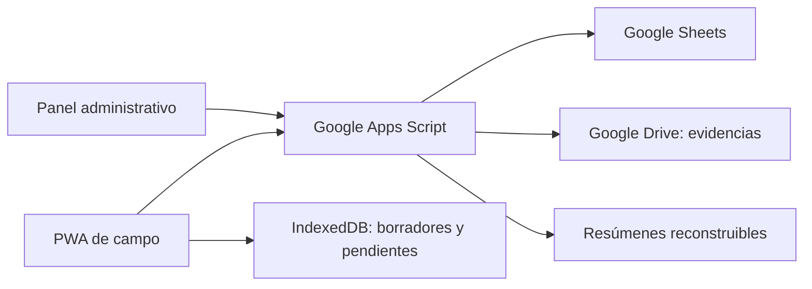

# Arquitectura revisada

Fecha: 2026-10-05. Diagrama del alcance observado, con nombres de componentes genéricos.

## Componentes y responsabilidades

- Sesiones y alcance por rol y almacén resueltos por el servidor.
- Solicitud, aprobación y despacho con bloqueo compartido y escrituras por lote.
- Idempotencia por clave y contenido; reintentos exactos recuperan el resultado.
- Cola local, borradores, evidencia y recuperación conservando pendientes.
- Consultas paginadas y resúmenes reconstruibles sin sustituir el historial.

## Arquitectura del repositorio público

Este repositorio contiene Markdown, un JSON sintético, un verificador Python de biblioteca estándar y un recorrido HTML autónomo. No contiene backend, servicios externos ni réplica del sistema operativo. El diagrama anterior describe la fuente local revisada.

## Límites

- Integración en una copia de Sheets y una carpeta Drive de pruebas.
- Comparación del código desplegado, permisos y activadores reales.
- Pruebas de dispositivos, red interrumpida y actualización de una PWA instalada.
- Aceptación humana de fotografías y firmas; decisiones de licencia.
